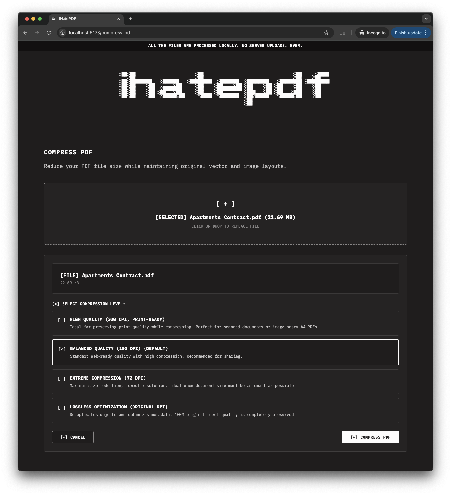

# ihatepdf

We all hate online PDF tools. They are slow, packed with annoying ads, force you to sign up, and make you upload your private documents to random servers. 

**ihatepdf** is a simple, private alternative. It runs 100% in your browser. Your files never leave your computer.

## Preview


## What it can do

*   **Organize:** Merge, split, delete pages, rotate, and rearrange them.
*   **Optimize & Repair:** Compress PDFs (lossless and custom DPI options) or attempt to repair corrupted ones.
*   **Convert:** Convert JPGs to PDF or export PDF pages as images.
*   **Edit:** Add page numbers, stamp custom watermarks, or sign pages with a custom signature.
*   **Security:** Protect your PDFs with passwords or unlock encrypted files.

## How it works (and why it's secure)

Standard PDF editors upload your files to their servers. We don't. 

Everything here runs locally on your machine using standard WebAssembly (WASM) ports of top-tier PDF libraries. Once the webpage loads, you could turn off your internet completely and every tool would still work. No accounts, no uploads, no tracking.

---

## Technical Stuff

### Tech Stack
*   **Frontend:** React 19, TypeScript, Tailwind CSS, Vite.
*   **Engines:** `pdf-lib`, `pdfjs-dist`, `mupdf` (WASM), `@jspawn/qpdf-wasm`, and `@jspawn/ghostscript-wasm`.

### Getting Started

Make sure you have [Bun](https://bun.sh) installed, then run:

```bash
# Install dependencies
bun install

# Run the dev server
bun dev

# Build for production
bun run build
```

### Hosting & Deployment

Because this is a Single Page Application (SPA), ensure your static hosting provider (Vercel, Netlify, Nginx, etc.) routes all unmatched paths back to `index.html`.

### Known Limitations

*   **Extreme Compression:** Setting DPI very low rasterizes pages, meaning text will no longer be selectable.
*   **Heavy Files:** Massive PDFs can be memory-intensive since everything is processed locally in your browser's tab.
